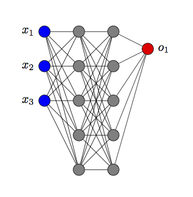
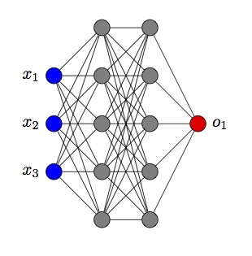

# Drawnn

A Latex package to create neural network figures in Latex.

It requires [`tikz`](https://www.ctan.org/pkg/pgf?lang=en) package to function.

## Usage

It's really straightforward to use in a latex document:

```latex
\drawnn{<input dimension>}{<output dimension>}{<hidden layer dimensions>}{<options>}
```

For example, to create a neural network with 3 input nodes, 1 output and two hidden layers of 5 neurons, you can use:

```latex
\drawnn{3}{1}{5,5}{}
\drawnn{3}{1}{5,5}{center}
```

<center>


</center>


## Full latex example

```latex
\documentclass{article}
\usepackage{nntikz}
\title{Example}
\begin{document}
  \maketitle
  \begin{figure}
    \drawnn{2}{1}{3,3,4,2}{}
  \end{figure}
\end{document}
```

## Options

There is only one option at the moment:

- `center`: use to center all nodes with respect to vertical axis.
